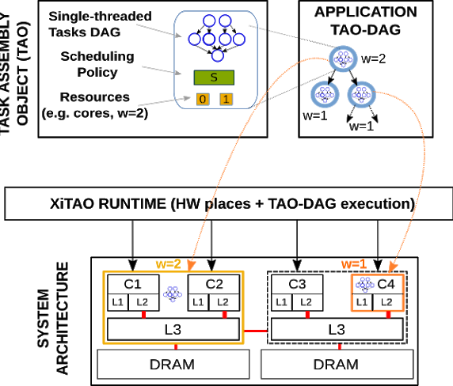

# XiTAO RUNTIME #
XiTAO is an execution model and runtime for low-overhead and interference-free execution of mixed-mode DAGs on manycores. XiTAO generalizes the concept of task by providing it with (1) internal concurrency, (2) an embedded scheduler and (3) a resizeable resource container. Hence, XiTAO tasks, called TAOs: "Task Assembly Objects" become moldable entities. Via a elastic resource partitioning, XiTAO provides better mapping between tasks and hardware resources such as cores, caches or interconnect bandwidth. Therefore, XiTAO provides fast parallelism at low overhead, with constructive sharing and interference-avoidance. 

The following figure shows the architecture of the XiTAO runtime



## Building the XiTAO Library ##
```bash
make lib
```

## Running Dot Product Example ##
```bash
cd benchmarks/dotproduct
make dotprod
export GOTAO_NTHREADS=nthreads 
./dotprod 8192 2 16
```

## Explanation for the Dot Product Example ##
read documentation.pdf

## Running Random DAGs Benchmark ##
```bash
cd benchmarks/randomDAGs
make randombench
export GOTAO_NTHREADS=nthreads 
./randombench 10 5 1000 1000 1000
```

## Sample Ouput of Random DAGs Benchmark##
```bash
Critical path length: 1852
Degree of prallelism: 1.61987
3000 Tasks completed in 3.62071s
Assembly Throughput: 828.567 A/sec
Total number of steals: 2209
```

## Turning on Debug Trace ##
```bash
cd ./include/
vim config.h
#define DEBUG
```

## Switching across Scheduling Strategies ##
```bash
vi makefile.sched
```

## ACKNOWLEDGEMENT ##
This work has been supported by EU H2020 ICT project LEGaTO, contract #780681.

